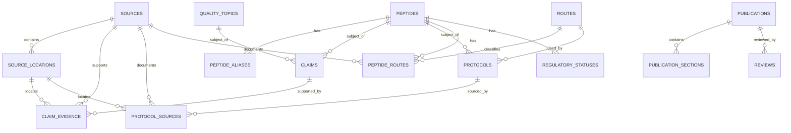

# DATABASE RELATIONSHIP MAP

## Key rule

A public article/reference page is a **presentation layer**, not the primary evidence store.

The canonical path is:

`Source -> Source Location -> Evidence Link -> Claim/Protocol/Route -> Publication`
